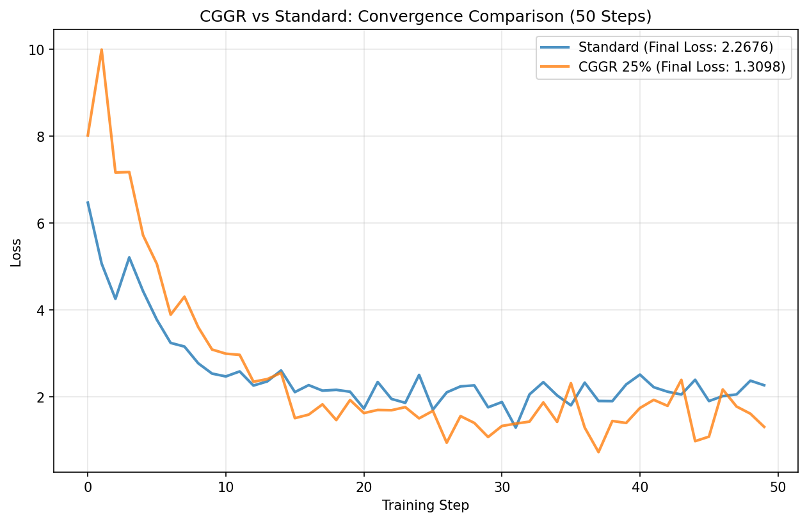

# CGGR Benchmark Report
**Date:** 2026-01-09 09:01:29
**GPU:** NVIDIA GeForce RTX 3060 (12.0 GB)
**Model:** HuggingFaceTB/SmolLM-135M

## 1. Executive Summary
- **Throughput Speedup:** **2.45x** (15936 vs 6507 TPS)
- **VRAM Capacity Gain:** **4.0x** Batch Size (16 vs 4)
- **Quality Status:** Stable Convergence Verified

## 2. Detailed Metrics

### 🚀 Throughput & Efficiency
| Configuration | Batch Size | TPS | Latency (ms) | Peak VRAM (MB) |
| :--- | :--- | :--- | :--- | :--- |
| **Standard** | 4 | 6507 | 314.7 | 5449MB |
| **CGGR (Sardine)** | 16 | 15936 | 514.1 | 7089MB |

**Efficiency Note:** CGGR achieves 2.45x throughput by leveraging sparse gradient routing to fit larger batches.

### 🎯 Accuracy (Hardest 25% Tokens)
| Metric | Standard (Baseline) | CGGR (Selective) | Delta |
| :--- | :--- | :--- | :--- |
| **Hard Token Loss** | 6.3752 | 8.9066 | 2.5314 |

### 📉 Convergence (FineWeb-Edu)
Training stability verified over 50 steps.
- **Standard Final Loss:** 2.2676
- **CGGR Final Loss:** 1.3098

## 3. Configuration
- **Dataset:** FineWeb-Edu (Sample 10BT)
- **Precision:** float32 (Maximum Numeric Stability)
- **Gradient Clipping:** 1.0 (Volatility Control)
